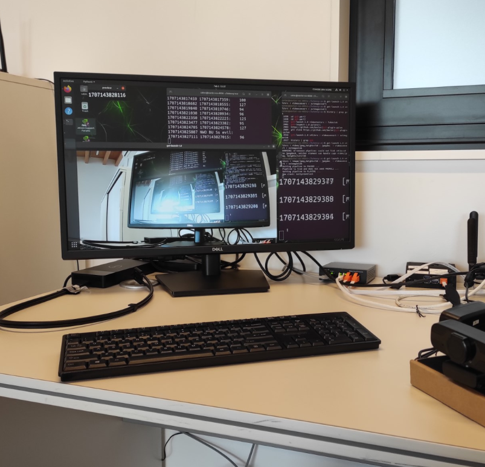

# Latency profiler

## Dependencies

- Python packages: OpenCV, Pillow, Pytesseract. `pip3 install -r requirements.txt`
- Tesseract executable: `apt install tesseract-ocr`

## Usage

Here's the detailed walkthrough:

- Run `./clocks.sh` on a terminal and zoom in for bigger characters.
- Start your video pipeline and point the camera to the `./clocks.sh` terminal.
- Have your video show its output on your screen.
- Run `./main.py` and use your left and middle mouse buttons to enclose the clocks.
- Press `q` to continue.
- The time difference in between clocks should be printing on your screen.

For more, call `main.py --help`. Expect having to do some image fine-tuning 
(thresholding, grayscaling...), mostly due to Tesseract's pitfalls.

